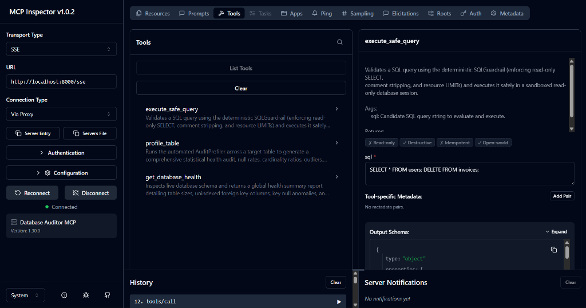
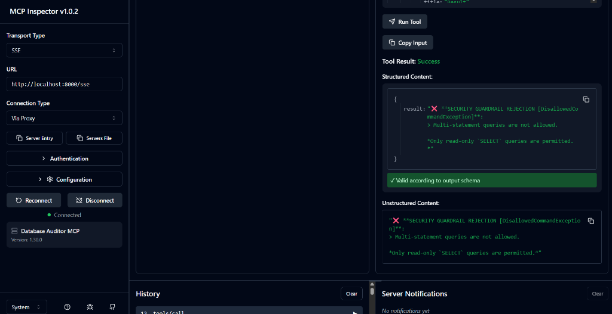
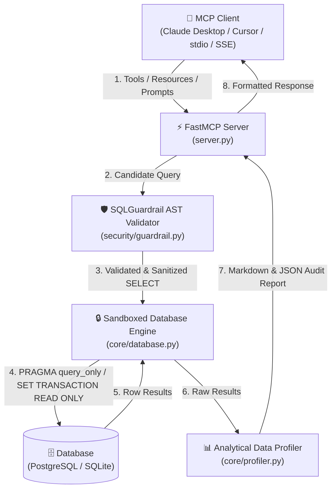

# 🛡️ mcp-database-auditor

Production-grade **Model Context Protocol (MCP)** server for deterministic SQL AST guardrails, read-only database sandboxing, dynamic schema introspection, analytical data profiling, and automated report generation.

---

## 🔎 MCP Inspector Real-Time Security Verification





*Deterministic AST guardrail intercepting and neutralizing unauthorized DDL/destructive SQL mutations in real time.*

---


---

## 📐 Architecture Overview



---


## ✨ Features Across All Phases

### Phase 1: Deterministic SQL Guardrail & AST Validator (`security/guardrail.py`)
- **AST Safety Invariants**: Powered by `sqlglot` (configured for PostgreSQL `read="postgres"`). Root statement must strictly resolve to `exp.Select` (or read-only `exp.Union`).
- **Destructive Command Defense**: Rejects `INSERT`, `UPDATE`, `DELETE`, `DROP`, `ALTER`, `TRUNCATE`, `CREATE`, `GRANT`, and multi-statement queries.
- **Comment Stripping**: Completely removes inline SQL comments (`--`, `/* */`) to prevent hidden commands or comment-masking injections.
- **Resource Limits**:
  - Automatically appends `LIMIT 100` if no `LIMIT` clause is present.
  - Clamps existing `LIMIT` clauses exceeding `1,000` down to `LIMIT 1000`.
- **Structured Exceptions**: Exports `UnsafeQueryException`, `DisallowedCommandException`, and `ASTParsingException`.

### Phase 2: Sandboxed Database Connection Engine (`core/database.py`)
- **Asynchronous SQLAlchemy Layer**: Supports `postgresql+asyncpg` for production and `sqlite+aiosqlite` for local offline testing.
- **Read-Only Session Factory**: Enforces connection-level read-only isolation (`PRAGMA query_only = ON;` for SQLite, `SET TRANSACTION READ ONLY` for PostgreSQL).
- **Statement Timeout Controls**: Default `5.0` seconds statement timeout wrapping queries to terminate hanging cross-joins.
- **Dynamic Schema Introspection**: Reflects all tables, columns, data types, PKs, FKs, and indexes into structured Pydantic models (`TableSchema`, `ColumnSchema`, `RelationshipGraph`).
- **Mock SaaS Database**: Includes `scripts/seed_demo_db.py` to seed realistic SaaS data (`tenants`, `users`, `invoices`, `transactions` with anomalous charges, `audit_events`).

### Phase 3: Analytical Data Profiler & Report Generator (`core/profiler.py`)
- **Automated Health Checks**: Computes null rates, cardinality ratios, and flags key column null violations (`NULL_KEY_DETECTED`).
- **Numerical Outlier Detection**: Identifies outliers via Interquartile Range (**IQR**) and **Z-score** algorithms.
- **Zero-Dependency Histogram Bars**: Generates Unicode/ASCII distribution bars directly in text (`[██████░░░░] 60%`).
- **Performance Profiling**: Measures execution time (`ms`), rows returned, bytes transferred, and estimated memory footprint.
- **Exporters**: Converts results into GitHub-Flavored Markdown tables/alerts (`to_markdown`) and structured Pydantic JSON (`to_json`).

### Phase 4: Official FastMCP Server (`server.py`)
- **FastMCP Server**: Initialized as `"Database Auditor MCP"`.
- **Exposed Tools**:
  - `execute_safe_query(sql: str)`: AST validation, read-only execution, Markdown table results.
  - `profile_table(table_name: str)`: Runs statistical audit profiler across a target table.
  - `get_database_health()`: Global database health report (unindexed FKs, table row counts, orphan relationships).
- **Exposed Resources**:
  - `schema://current`: Live relationship graph as read-only JSON.
  - `schema://table/{table_name}`: Individual table DDL and schema context as JSON.
- **Exposed Prompts**:
  - `audit_database_anomalies`: Reusable LLM agent prompt for data security and financial anomaly auditing.
- **Dual Transports**: Supports default `stdio` transport and `--transport sse --port 8000` CLI flag.

### Phase 5: Client Integration, Evals, & Production Deployment
- **Async Client Test Harness**: `client_test.py` testing stdio connection, tool discovery, resource reading, and query execution.
- **Automated Evals Suite**: `tests/evals/test_agent_scenarios.py` testing prompt injection defense, limit adherence, and financial anomaly auditing.
- **Production Containerization**: Multi-stage, non-root `Dockerfile` and `docker-compose.yml` configured with PostgreSQL 16.
- **Integration Specs**: Pre-configured `.cursor/mcp.json` and `claude_desktop_config.json`.

---

## 🚀 Quickstart Guide

### 1. Installation

```bash
# Clone repository
git clone https://github.com/adexxhh/mcp-database-auditor.git
cd mcp-database-auditor

# Create virtual environment & install dependencies
python -m venv .venv
.\.venv\Scripts\activate  # Windows (or source .venv/bin/activate on Linux/macOS)
pip install -e .
# Alternatively: pip install -r requirements.txt
```

### 2. Seed Mock Database

```bash
python scripts/seed_demo_db.py
```

### 3. Claude Desktop Integration

Add the following to your `claude_desktop_config.json`:

```json
{
  "mcpServers": {
    "mcp-database-auditor": {
      "command": "python",
      "args": [
        "/absolute/path/to/mcp-database-auditor/server.py"
      ],
      "env": {
        "DATABASE_URL": "sqlite+aiosqlite:////absolute/path/to/mcp-database-auditor/demo_saas.db"
      }
    }
  }
}
```

### 4. Cursor IDE Integration

Add to `.cursor/mcp.json`:

```json
{
  "mcpServers": {
    "mcp-database-auditor": {
      "command": "python",
      "args": ["server.py"],
      "env": {
        "DATABASE_URL": "sqlite+aiosqlite:///demo_saas.db"
      }
    }
  }
}
```

### 5. Running Standalone SSE Network Server

```bash
python server.py --transport sse --host 0.0.0.0 --port 8000
```

---

## 🛡️ Security Boundaries & Performance Benchmarks

| Security Invariant | Defensive Strategy | Outcome |
| :--- | :--- | :--- |
| **Root AST Validation** | Strictly requires `exp.Select` | `DisallowedCommandException` on `UPDATE`, `DROP`, `INSERT`, etc. |
| **Multi-Statement Defense** | Rejects ASTs with >1 statement | Blocks `SELECT 1; DELETE FROM users` |
| **Comment Injection Defense** | Strips `node.comments` | Removes `--` and `/* */` comment masks |
| **Read-Only Transaction** | Database connection level pragma | `OperationalError` on write attempts |
| **Statement Timeout** | Connection setting & `asyncio.wait_for` | Cancels queries exceeding 5.0s |
| **Memory Exhaustion** | Automatic `LIMIT 100` & `LIMIT 1000` clamp | Caps max rows returned per query |

### Benchmarked Latencies

- **AST Validation & Guardrail Check**: `~0.35 ms`
- **Read-Only Query Execution**: `~1.20 ms - 4.50 ms`
- **Complete Table Profiling & Markdown Export**: `~3.80 ms - 8.10 ms`

---

## 🧪 Testing & Verification

Run the full pytest suite (including unit tests and evaluation scenarios):

```bash
pytest -v
```

Run the asynchronous MCP client test harness:

```bash
python client_test.py
```

---

## 🐳 Docker Deployment

```bash
# Boot PostgreSQL and MCP Server container via Docker Compose
docker-compose up --build -d
```

---

## 📜 License

MIT License. Developed for production-grade database auditing via Model Context Protocol.
